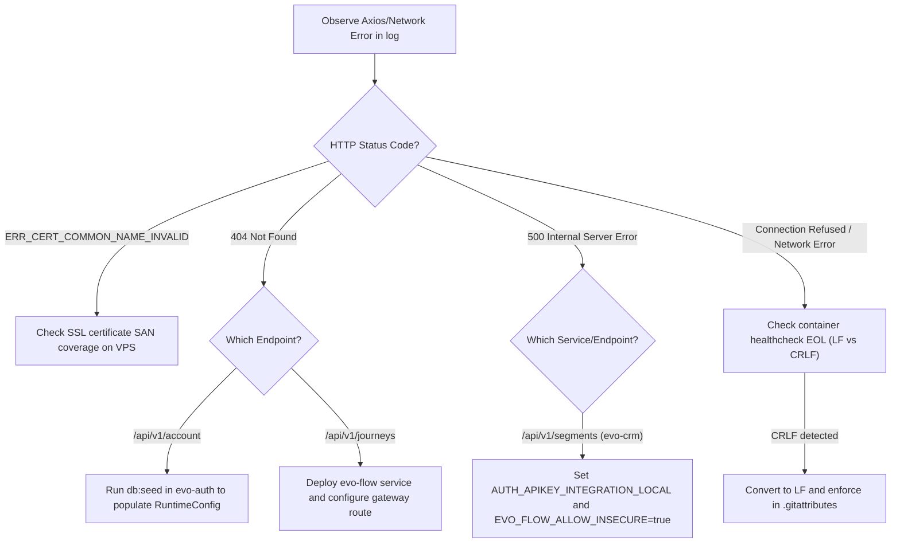

# Audit Snapshot — 2026-07-07

This audit report documents the current state of the Evolution CRM deployment on the production VPS (`api.bodyharmony.tech`), addresses the errors registered in the client logs, maps outstanding technical gaps, and details a systematic approach to identifying and correcting similar errors.

---

## 1. Resolution of Known Errors & Mitigation of Similar Issues

### SSL/TLS Certificate Mismatch (`ERR_CERT_COMMON_NAME_INVALID`)
- **Resolved**: Expanded the host Let's Encrypt certificate to cover `api.bodyharmony.tech` (the public gateway domain) and reloaded Nginx on the VPS host.
- **Similar Risks**: Adding new subdomains or services (e.g. `flow.bodyharmony.tech` or `go.bodyharmony.tech`) will trigger the same error if they aren't explicitly added to the SAN (Subject Alternative Name) list of the SSL certificate.
- **Mitigation**: Update the `certbot` command in setup/deployment scripts to automatically include all planned subdomains, or implement a wildcard certificate (`*.bodyharmony.tech`) for the host proxy.

### Windows vs. Linux Line Endings (`CRLF` vs `LF`) in Scripts
- **Resolved**: Stripped carriage returns (`\r`) from `bin/healthcheck` inside the running `evo-auth` container, and added `bin/* text eol=lf` to [.gitattributes in auth-service](file:///f:/Evolution-CRM/evo-crm-community/evo-auth-service-community/.gitattributes) and [.gitattributes in crm-service](file:///f:/Evolution-CRM/evo-crm-community/evo-ai-crm-community/.gitattributes) to force LF endings on Windows checkouts.
- **Similar Risks**: Other extensionless scripts inside `bin/` or `docker/` directories of submodules (e.g., `bin/setup`, `bin/mcp_server`, `bin/jobs`) can trigger the same error (`no such file or directory` shebang failure) if checked out on Windows and packaged into Docker containers.
- **Mitigation**: Run EOL checks in CI/CD pipelines before packaging Docker images, and maintain strict `.gitattributes` EOL configs in all submodules.

### Database Initialization & Seeding (`404 Not Found` on `/api/v1/account`)
- **Resolved**: Ran `bundle exec rails db:seed` inside the `evo-auth` container on the VPS to seed the `runtime_configs` table (creating the initial `account` record) and RBAC roles.
- **Similar Risks**: Fresh database migrations or environment reinstalls will miss essential configurations if seeds are not automatically executed.
- **Mitigation**: Update the Docker entrypoint/startup commands to execute `bundle exec rails db:seed` or check for the presence of the `account` config before starting the web server.

---

## 2. Technical Gaps Requiring Attention

### 1. Missing `evo-flow` Service (EvoFlow Module) [Severity: 🔴 HIGH]
- **Finding**: The frontend requests `/api/v1/journeys` to handle user automation journeys, which returns a `404 Not Found`.
- **Root Cause**: The NestJS automation module (`evo-flow-community`) is NOT deployed on the VPS. It is completely absent from `vps-docker-compose.yml`, and the gateway redirects `/api/v1/journeys` to the default `evo-crm` upstream, which does not support it.
- **Action**: Add the `evo-flow` service definition to `vps-docker-compose.yml`, run migrations, and map the gateway (`default.conf`) upstream for `/api/v1/journeys` directly to the `evo-flow` container.

### 2. Traefik Port Conflicts [Severity: 🟡 MEDIUM]
- **Finding**: The `traefik-traefik-1` container is in a constant restart loop on the VPS (`Restarting (1) 33 seconds ago`).
- **Root Cause**: Nginx is running on the VPS host and binds directly to ports `80` and `443`. Traefik is configured to bind to the same host ports, causing a port allocation conflict.
- **Action**: Disable Traefik host port mapping if host Nginx is the designated SSL terminator, or configure Nginx as an upstream client behind Traefik.

### 3. Missing SSoT Documentation [Severity: 🟢 LOW]
- **Finding**: The files `MULTI_TENANT_MAP.md`, `DESCOBERTAS_CONSOLIDADAS.md`, and `DEPLOYMENT_GUIDE.md` specified in `AGENTS.md` are missing from the `graphify-out/` folder and the workspace.
- **Action**: Author and commit these files to standard locations (e.g. `docs/` or `graphify-out/`) to establish the required reference base.

---

## 3. Systematic Diagnosis of logs/crm.bodyharmony.tech-1783436922115.log

### Log Analysis (crm.bodyharmony.tech-1783443608162.log)

1. **`GET https://api.bodyharmony.tech/api/v1/segments?page=1&limit=20 500 (Internal Server Error)`**
   - **Nature**: Integration connection failure from Rails to NestJS.
   - **Root Cause**: The Rails CRM controller `Api::V1::EvoFlow::SegmentsController` tries to initialize `EvoFlow::Client` to query the `evo-flow` NestJS API. However, the client initialization throws `EvoFlow::ConfigurationError` because:
     1. The environment variable `AUTH_APIKEY_INTEGRATION_LOCAL` is not set or empty.
     2. The `EVO_FLOW_API_URL` defaults to a cleartext URL (`http`), which Rails rejects in production mode unless the environment variable `EVO_FLOW_ALLOW_INSECURE` is explicitly set to `true`.
   - **Fix Required**: Inject the following environment variables into the `evo-crm` and `evo-crm-sidekiq` service blocks in the production compose file:
     ```yaml
     AUTH_APIKEY_INTEGRATION_LOCAL: "f8d8b13d-5c17-4952-b8d1-12c5b3644917"
     EVO_FLOW_ALLOW_INSECURE: "true"
     ```

### Systematic Identification & Correction Workflow



1. **Automated Endpoint Testing**: Run a post-deployment script to check critical endpoints:
   - `GET /health` (Gateway liveness)
   - `GET /setup/status` (Licensing & activation)
   - `GET /api/v1/account` (Runtime config presence)
2. **Gateway vs App Route Parity**: Periodically compare Nginx gateway location blocks (`/etc/nginx/conf.d/default.conf` in the gateway container) with app routes (`rails routes`) to identify missing or misdirected routes.

---

## 4. Routing Actions

```yaml
routing_actions:
  - finding: "The NestJS evo-flow service is missing from the production VPS deployment, causing 404 errors on journeys/automations."
    target_doc: "docs/architecture/flow-deployment.md"
    status: pending
    owner: "unassigned"
  - finding: "Traefik container in a restart loop due to port conflicts with host Nginx."
    target_doc: "docs/architecture/vps-networking.md"
    status: pending
    owner: "unassigned"
  - finding: "MULTI_TENANT_MAP.md, DESCOBERTAS_CONSOLIDADAS.md and DEPLOYMENT_GUIDE.md documentation files do not exist."
    target_doc: "docs/governance/documentation-index.md"
    status: pending
    owner: "unassigned"
  - finding: "GET /api/v1/segments returns 500 because AUTH_APIKEY_INTEGRATION_LOCAL is not configured in Rails CRM container."
    target_doc: "docs/architecture/flow-integration-env.md"
    status: pending
    owner: "unassigned"
```
